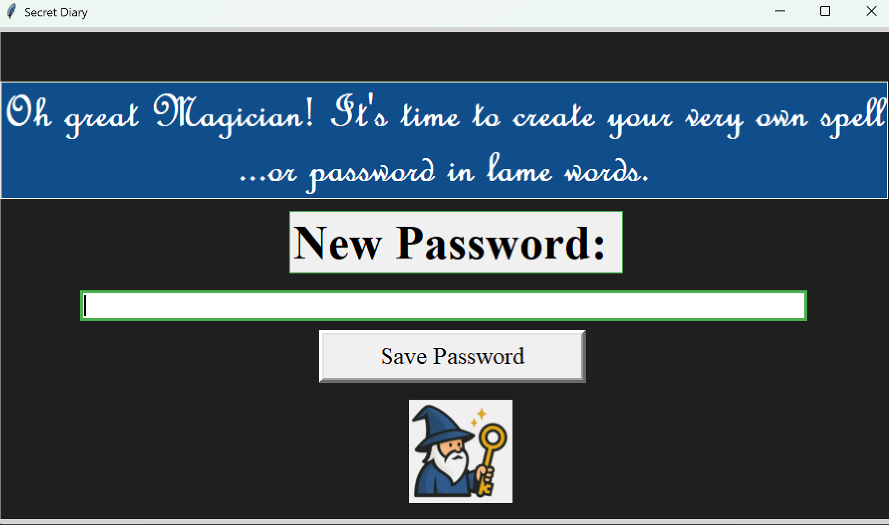

# 📓Diary Program| Personal Project 1

## A magic-themed Python diary made using Tkinter. Utilizes bcrypt for password protection, and JSON for entry storage

----
### 🎮**Features**
- A single user utility
- Magic-themed
- Password protected with `bcrypt`
- Uses JSON to store user data and password
- User can view previous entries

----
### 🎮**Controls**
- `View Previous Entries` - Viewing previous entries
- `Add Entry` - Adding a new entry
- `Save Password` - Saving a new password

---
### ❓**How Is It Run**

1. Open a terminal  
2. Navigate to the project folder:
   ```bash
   git clone https://github.com/Kaustubh-forges/Diary.git
   cd Diary
   python Diary.py
   ```
3. You can also run the code in an IDLE such as Visual Studio Code or PyCharm

### 💻 **Sneak Peek**


### 🙏 **Credits**
All code in this project is original. The wizard, diary, and troll images were generated with AI.